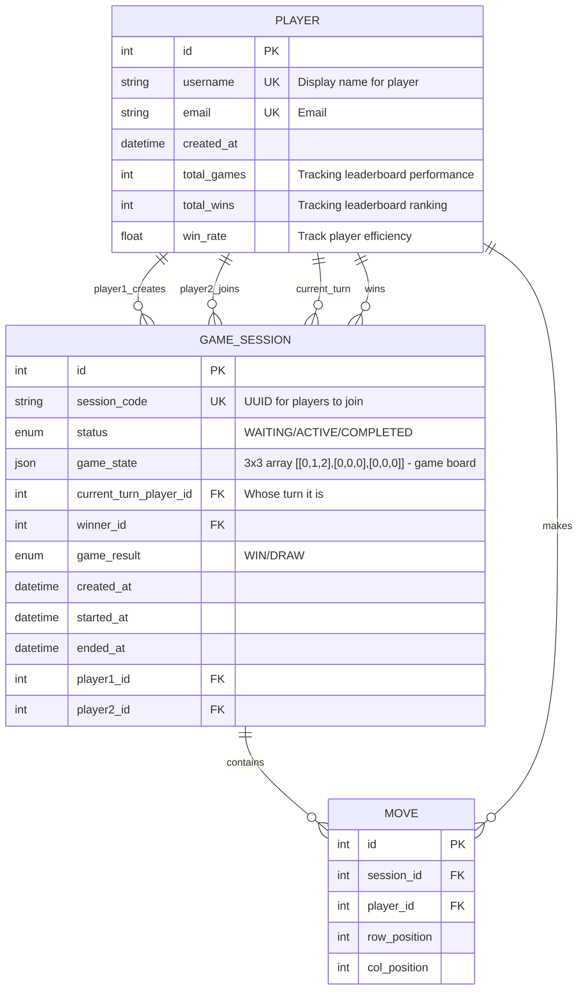

# Nclusion-grid-game
## How to run: 
``` bash
 uvicorn app.main:app --reload 
 ```
## Testing

To run the tests:

```bash
# Run all tests
pytest

# Run all tests with coverage
pytest --cov=app --cov-report=term-missing --cov-report=html --cov-config=.coveragerc

```

## ER Diagram
