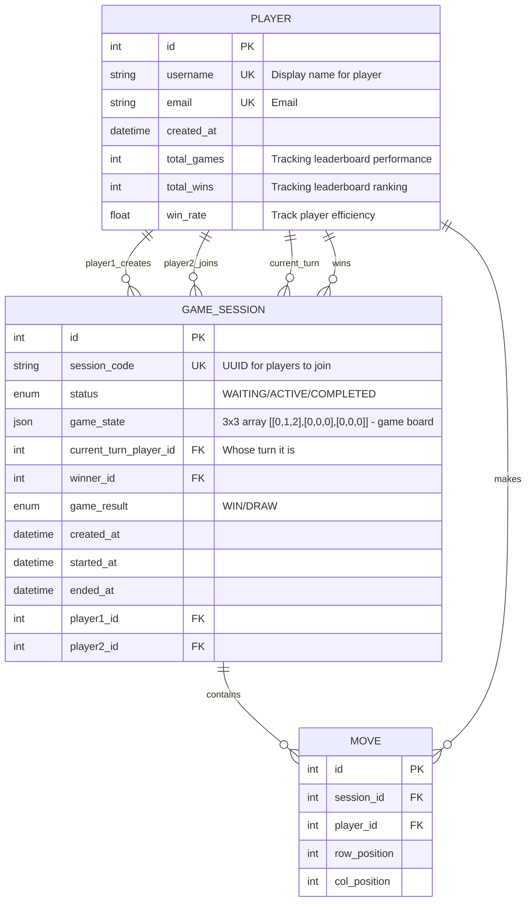

# Backend SWE Take Home Interview | BE-001-T3

## Key Design Decisions

This project implements the Grid Game using FastAPI (Python) with the following technologies:

- **FastAPI (Python 3.9+)**: Modern, fast web framework for building APIs
- **SQLAlchemy**: SQL toolkit and ORM for database operations
- **Pydantic**: Data validation and settings management
- **SQLite**: Lightweight relational database
- **PyTest**: Code Coverage and testing framework

### Architecture
The project follows the below structure:

1. **API Layer (Routes)**: Handles HTTP requests and responses
2. **Service Layer**: Contains business logic and use cases
3. **DB Layer**: Handles data access and persistence

Each layer has clear responsibilities:
- Routes handle request/response and parameter validation
- Services implement business logic
- Models define the database schema and relationships

### Database Design



### API Endpoints
#### Game Player

- `POST /api/v1/player/` - Create a new player
- `GET /api/v1/player/{player_id}` - Get player details

#### Game Session

- `POST /api/v1/gameSession/create` - Create a new game session
- `POST /api/v1/gameSession/join/{session_code}` - Join an existing game session
- `GET /api/v1/gameSession/{session_id}` - Get game session details

#### Game Move

- `POST /api/v1/move/` - Make a move in the game
- `GET /api/v1/move/{move_id}` - Get game move details
- `GET /api/v1/move/session/{session_id}` - Get all moves for a game session

#### Leadeboard
- `GET /api/v1/leaderboard/wins` - Get leaderboard by total wins (Top 3 Players)
- `GET /api/v1/leaderboard/efficiency` - Top leaderboard by efficiency (Top 3 Players)

### Quick Start
1. Clone the project
    ```bash
    git clone https://github.com/manikey123/Nclusion-grid-game.git
    cd grid-game-engine
    pip install -r requirements.txt
    ```

2. Start the server

    ``` bash
    uvicorn app.main:app --reload 
    ```
The application will be available at `http://localhost:8000`

3. Access the automatically generated API documentation:
   - Swagger UI: `http://localhost:8000/docs`
   - ReDoc: `http://localhost:8000/redoc`

### Testing
To run the tests:

```bash
# Run all tests
pytest

# Run all tests with coverage
pytest --cov=app --cov-report=term-missing --cov-report=html --cov-config=.coveragerc
```

### Game Simulation
#### Run Concurrent Game Simulation
```bash
python -m app.scripts.simulation
```

### AI Tool Usage
During development, I used AI assistance for:

1. **Code Generation**: Generated bootstrap / boilerplate code for models, schemas, and service layers. 
2. **Test Strategy**: Created few test cases for core functionality
3. **Game Simulation Script**: Generated code for the concurrent game simulation script with detailed usage statistics. 

### Future Improvements

With more time, the following enhancements could be made:
1. **Containerization**: 
   - Use Docker to containerize and run the application as a standalone image. 
2. **Performance Optimizations**:
   - Implement caching for frequently accessed data
   - Rate limiting middleware restricts request frequency
3. **DevOps**:
   - CI/CD pipeline for automated testing and deployment
   - Monitoring and logging infrastructure
4. **Error Handling**:
   - More descriptive error messages for debugging